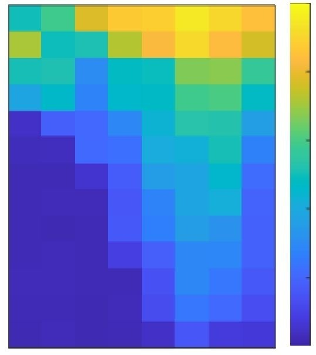
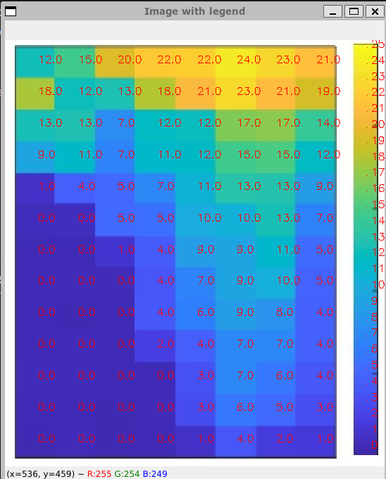

## Goal
The goal is to extract values from heatmap, given the legend color bar and legend min and max values.

This code was written because [this](http://www.graphreader.com/2dreader) didn't work.

## Installation
Seems like `colormath` doesn't work with newer versions of `numpy`, so an older version of `numpy` needs to be used, which means older version of `opencv-python` needs to be used, which doesn't run well of Python 3.8+...

This is the setup in which the code works:
Use python 3.6.X
Upgrade `pip` using `pip install --upgrade pip`.

Then install packages with `pip install -r requirements.txt`

## Getting the results
An image like this is expected:

We need to manually extract some information from it:
- `(x_start, y_start)` and `(x_end, y_end)` - top left and bottom right positions of the heatmap
- `n` and `m` - number of rows and columns in the heatmap
- `x_legend` - the x coordinate of the legend bar
- `y_legend_bottom` and `y_legend_top` - y range of the legend bar
- `legend_min` and `legend_max` - range for legend values
- `number_of_legend_steps` - how many values to extract from the legend

To get these values, you can run `preview_image.py`. The image will be shown and you can hover above it to identify all the necessary coordinates. Or you can use some other tool to do this.

Fill those values into `extract_values` script and run it.
At the end, the extracted values will be shown on the image and printed in the terminal.

